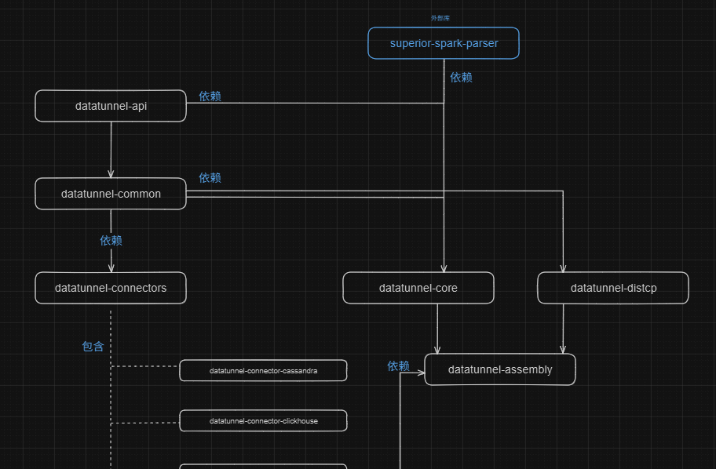

# melin-datatunnel
下面是原作者项目连接：  
[学习melin-datatunnel项目](https://github.com/melin/datatunnel/tree/master)

#### model 依赖关系

#### 学习
[多语言代码格式化工具：spotless-maven-plugin](https://github.com/diffplug/spotless/tree/main/plugin-gradle)  
[NotEmpty,NotBlank,NotNull注释的使用](./doc/NotEmpty等使用.md)  
[Java ORM 学习](./doc/Java_ORM学习.md)